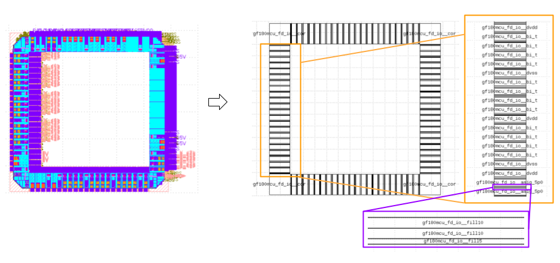
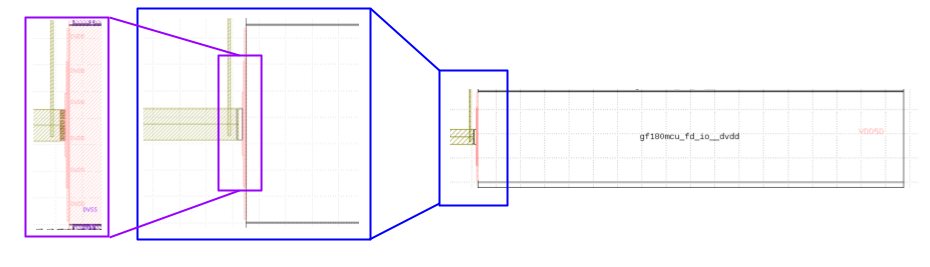
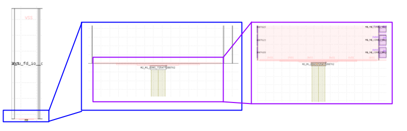
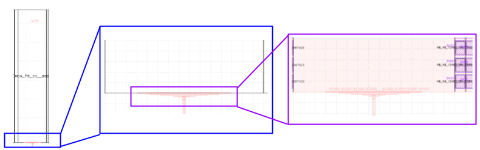
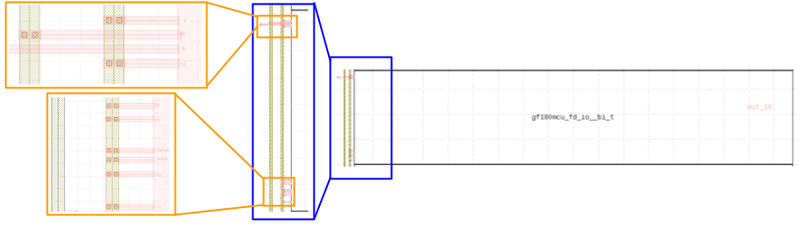

# IEEE SSCS Chipathon2025: Integration Track Documentation 
This repository contains the primary documentation related to the Integration track for the [IEEE SSCS Chipathon 2025](https://github.com/sscs-ose/sscs-chipathon-2025/)

The padring provided for this Chipathon was generated by Mehdi Saligane's research group. The GF180mcu padring can be found [here](https://github.com/idea-fasoc/openfasoc-tapeouts/tree/main/gf180mcu_padframe).

Below is an image of the layout pattern and the different cells that compose it.

   

  

Here is a list of the different cells that can be included in this padring, the information can be found in [GlobalFoundries GF180MCU PDK documentation](https://gf180mcu-pdk.readthedocs.io/en/latest/IPs/IO/gf180mcu_fd_io/datasheet.html) and [GlobalFoundries GF180MCU PDK repository](https://github.com/google/globalfoundries-pdk-libs-gf180mcu_fd_io/tree/main/cells):

## Digital pin cells

| Cell Type | Cell Name  | Description |
| ------------- | ------------- | ------------- |
| Bidirectional | gf180mcu_fd_io__bi_t  | 5V WR bidirectional pad with programmable drive strength of 4mA, 8mA, 12mA and 16mA tri-state output buffer, fast/slow slew rate control, pull-up/down and selectable CMOS/Schmitt input.  |
| Bidirectional | gf180mcu_fd_io__bi_24t  | 5V WR bidirectional pad with 24mA drive strength tri-state output buffer, fast/slow slew rate control, pull-up/down and selectable CMOS/Schmitt input.|
| Input | gf180mcu_fd_io__in_c | 5V WR CMOS input only pad with pull-up/down |
| Input | gf180mcu_fd_io__in_s | 5V WR Schmitt Trigger input only pad with pull-up/down |

## Analog pin cells
| Cell Type | Cell Name  | Description |
| ------------- | ------------- | ------------- |
| Analog | gf180mcu_fd_io__asig_5p0 | 5V WR analogue signal pad with double diode protection (DC current carrying capability 10mA) |
| Tim Edwards Custom Cell | ------------- | ------------- |

## Power pin cells
| Cell Type | Cell Name  | Description |
| ------------- | ------------- | ------------- |
| Power Supply | gf180mcu_fd_io__dvdd | Power supply cell (DC current carrying capability 60mA) |
| Power Supply | gf180mcu_fd_io__dvss | Ground cell (DC current carrying capability 60mA) |

## Additional/Specific Purpose pin cells
| Cell Type | Cell Name  | Description |
| ------------- | ------------- | ------------- |
| Corner | gf180mcu_fd_io__cor | Corner cell |
| Filler | gf180mcu_fd_io__fillnc * | Filler for gap width less than 1μm |
| Filler | gf180mcu_fd_io__fill1 | 1μm filler |
| Filler | gf180mcu_fd_io__fill5 | 5μm filler |
| Filler | gf180mcu_fd_io__fill10 | 10μm filler |
| Breaker | gf180mcu_fd_io__brk2 | 2μm Breaker with VSS |
| Breaker | gf180mcu_fd_io__brk5 | 5μm Breaker with VSS |

It's important to note that the pin distribution will change based on the integrated projects, as demonstrated by the three projects submitted for the 2023 Chipathon. Here are the repositories of the project submitted.

- [LTC1](https://github.com/Azeem-Abbas/DC23-LTC1/tree/main)
- [LTC2](https://github.com/akiles-esta-usado/DC23-LTC2/tree/f6358b6aff1b4526a014195b640335f1def6f0c5/padframe)
- [LTC3 - Bracolin](https://github.com/gabrielmaranhao/Bracolin/tree/main)

Follows a description of the main pin cells used in Bracolin and some examples for pin connection.

Configuration for each of the pin cells provided for GlobalFoundries GF180MCU PDK are [here](https://gf180mcu-pdk.readthedocs.io/en/latest/IPs/IO/gf180mcu_fd_io/functional.html). All the I/O cells include ESD protections.

Some of the main cells included in Bracolin are:
- gf180mcu_fd_io__dvdd
- gf180mcu_fd_io__dvss
- gf180mcu_fd_io__asig_5p0 (analog inputs)
- gf180mcu_fd_io__bi_t (digital outputs)

Below is the layout connection for the VDD pin (gf180mcu_fd_io__dvdd).

   

  

Then, the layout connection for the VSS pin (gf180mcu_fd_io__dvss).

   

 

Follows the layout connection for the Analog input pin (gf180mcu_fd_io__asig_5p0).

   

 

Finally, the layout connection for the Digital inputs and outputs (gf180mcu_fd_io__bi_t).

   

 
